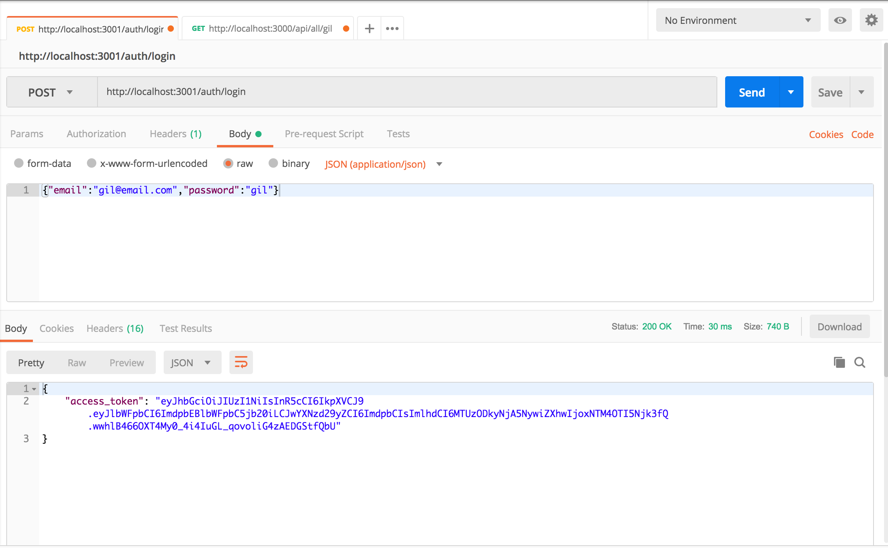
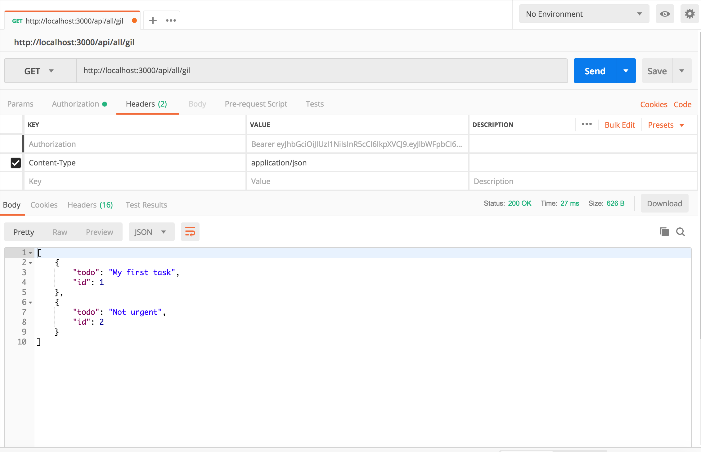
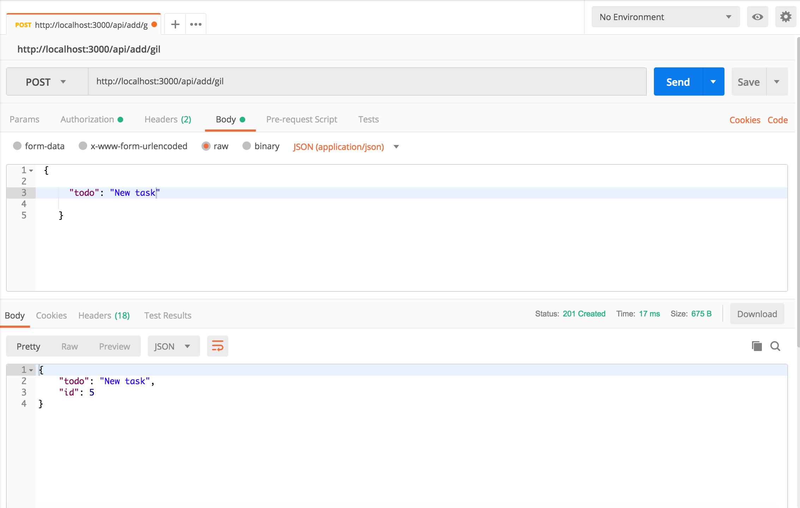
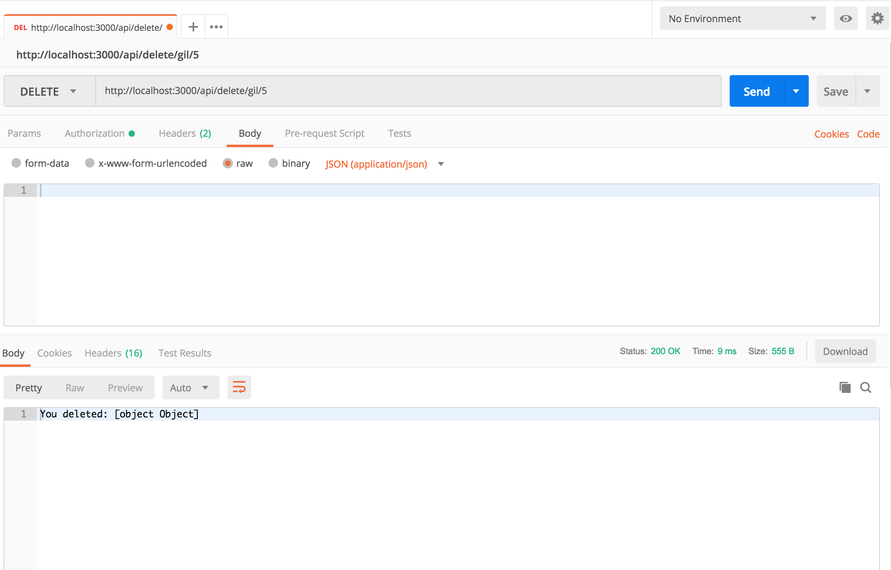
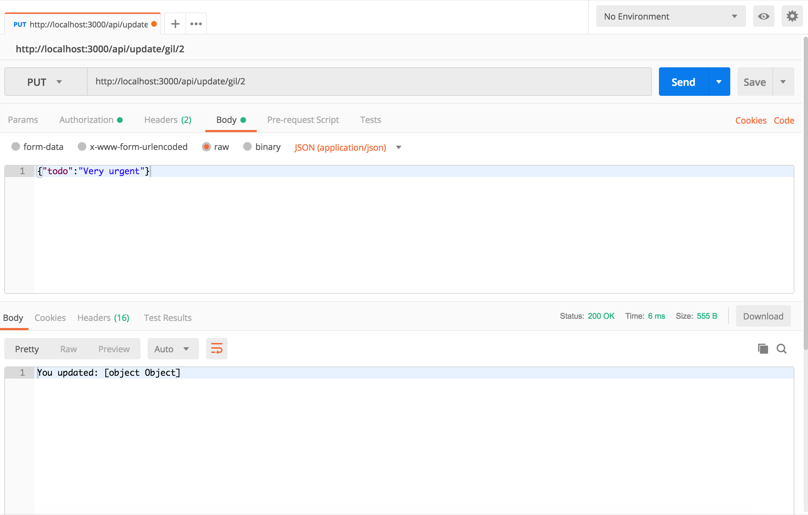
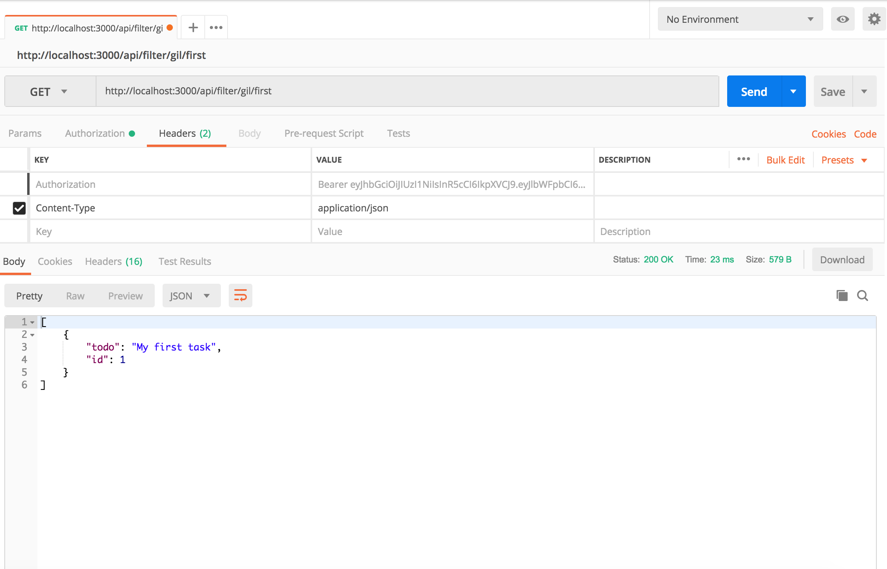

# todoapp

A Fake REST API using json-server with JWT authentication for a simple TODO app


## Install

```bash
$ npm install
$ node api
```

## How to login?

You can login by sending a POST request to

```
POST http://localhost:3001/auth/login
```
with the following data 

```
{
  "email": "gil@email.com",
  "password":"gil"
}
```

You should receive an access token with the following format 

```
{
   "access_token": "<ACCESS_TOKEN>"
}
```


You should send this authorization with any request to the protected endpoints

```
Authorization: Bearer <ACCESS_TOKEN>
```




You can check if token is well formatted at : <a href='https://jwt.io/#debugger'>https://jwt.io/#debugger</a>


## Available APIs

You can use <a href='https://www.getpostman.com/'>POSTMAN</a> to check the different endpoints


### Get all Todos from a specific user

PUBLIC

```
GET http://localhost:3000/api/all/:user

```

PRIVATE

```
GET http://localhost:3000/api/:user

```



### Add a new Todo to a specific user

PUBLIC

```
POST http://localhost:3000/api/add/:user

```

PRIVATE

```
POST http://localhost:3000/api/:user

```

Body:

```
{  
  "todo":"New task"
}
```



### Delete Todo by ID to a specific user

PUBLIC

```
DELETE http://localhost:3000/api/delete/:user/:id

```

PRIVATE

```
DELETE http://localhost:3000/api/:user/:id

```



### Update Todo by ID to a specific user

PUBLIC 

```
PUT http://localhost:3000/api/update/:user/:id

```

PRIVATE 

```
PUT http://localhost:3000/api/:user/:id

```

Body:

```
{  
  "todo":"Updated task"
}
```



### Filter Todos from a specific user by text

PUBLIC

```
GET http://localhost:3000/api/filter/:user/:query

```

PRIVATE

```
GET http://localhost:3000/api/:user?q=query

```

