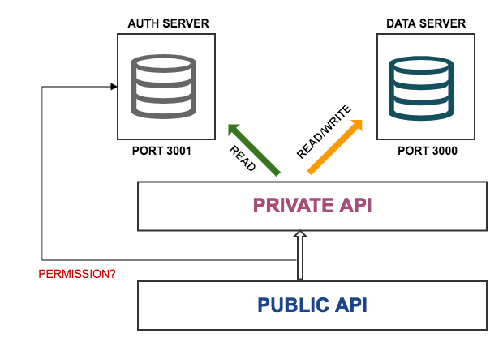

# todoapp

A Fake REST API using json-server with JWT authentication for a simple TODO app



## Install

```bash
$ npm install
$ node api
```

## How to login?

You can login by sending a POST request to

```
POST http://localhost:3001/auth/login
```
with the following data 

```
{
  "email": "gil@email.com",
  "password":"gil"
}
```

You should receive an access token with the following format 

```
{
   "access_token": "<ACCESS_TOKEN>"
}
```


You should send this authorization with any request to the protected endpoints

```
Authorization: Bearer <ACCESS_TOKEN>
```
